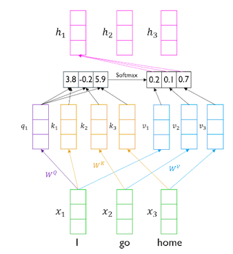
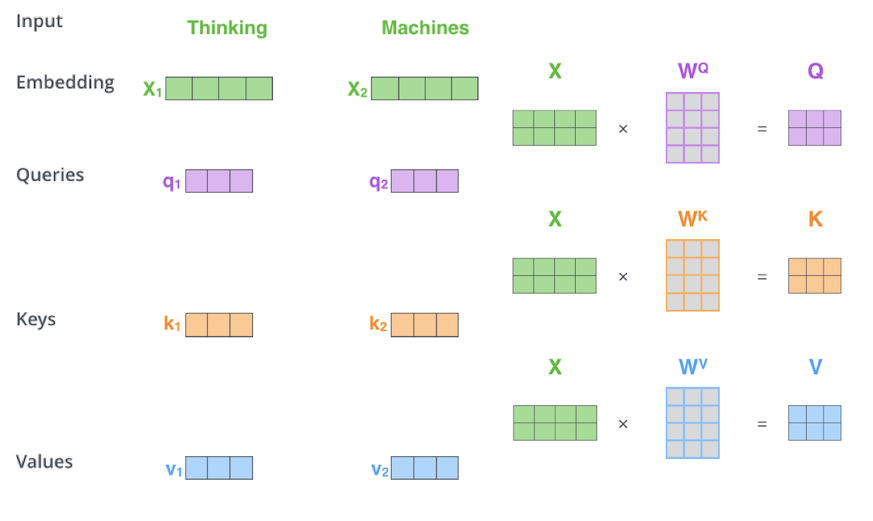
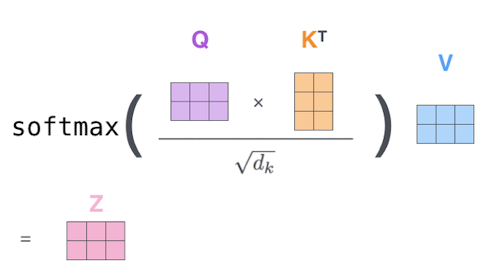

# Transformer(1)
- 기존에 rnn, lstm을 기반으로 두고 attention을 사용을 했다면 아예 처음부터 데이터를 attention으로만 다룬다.
- Long Term Dependency가 월등히 개선되었음.
- 기존의 RNN방식에 비해서 병목현상이 없음.
  
  

- 입력 X를 이용해서 Q, K, V를 만든다.
- 구한 Q, K, V를 이용해서 아래와 같이 연산한다.
  
- d_k의 의미 :
    - d_k가 커지면 분산이 커진다.
    - 분산이 커지면 softmax 확률 분포가 큰값에 몰려서 불안정하다.
    - 분산이 작으면 안정될 수 있다.
    - 더 공부해야할듯
- transformer는 attention으로만 이루어진 구조다.
- transformer를 사용하면서 기존의 마지막 rnn벡터가 이전의 모든 데이터를 정리했다가 decoder로 넘겨줬는데 이제 encoder decoder가 직접 모든 데이터를 이용하는 구조다.
- Q,K,V가 있고, K와 V는 한쌍으로 존재한다. 
- W^Q, W^K, W^V를 학습하는 구조
- 그림이 모든걸 말해준다.